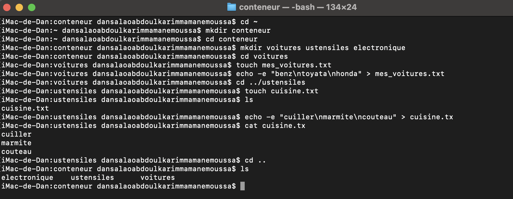

# Correction - Exercice 2 : Organisation Thématique (echo, cat)

 Tâche  Commandes Exécutées  Résultat / Vérification 

Remarques 
 
 Créer et entrer dans conteneur | `mkdir conteneur` `cd conteneur` | `pwd` -> ~/conteneur | Navigation standard. 
 Créer les sous-dossiers | `mkdir voitures ustensiles electronique` | `ls` -> electronique  ustensiles  voitures | Création multiple. 
 Remplir mes_voitures.txt | `echo "benz" > voitures/mes_voitures.txt` `echo "toyota" >> voitures/mes_voitures.txt` `echo "honda" >> voitures/mes_voitures.txt` | `cat voitures/mes_voitures.txt` -> benz toyota honda | **Clé :** `>` pour écraser/créer, `>>` pour ajouter à la suite. |
 Remplir cuisine.txt | `echo "cuillere" > ustensiles/cuisine.txt` `echo "marmite" >> ustensiles/cuisine.txt` `echo "couteau" >> ustensiles/cuisine.txt` | - | Idem que ci-dessus. |
 Vérifier cuisine.txt | `cat ustensiles/cuisine.txt` | cuillere marmite couteau | `cat` (concatenate) affiche le contenu du fichier. 
 Lister conteneur | `ls` | electronique  ustensiles  voitures | Liste les éléments du répertoire courant. |
 Retour | `cd ..` | `pwd` -> ~ | Retour au répertoire personnel. |

** Ps: Difficulté Rencontrée :** S'assurer de bien utiliser `>>` après la première ligne pour ne pas écraser le contenu précédent du fichier

