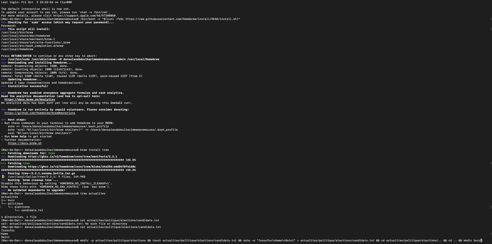

# Correction - Exercice 3 : Arborescence Hiérarchisée (mkdir -p, cd ../..)

| Tâche | Commandes Exécutées | Résultat / Vérification | Remarques |
| :--- | :--- | :--- | :--- |
| Créer actualites/politique | `mkdir -p actualites/politique` | `ls actualites` -> politique | **Clé :** L'option **`-p`** crée les répertoires parents (`actualites`) si nécessaire. |
| Entrer dans politique | `cd actualites/politique` | `pwd` -> ~/actualites/politique | Navigation. |
| Créer elections et candidats.txt | `mkdir elections` `echo -e "Issoufou\nHama\nSeini" > candidats.txt` | `ls` -> candidats.txt  elections | Utilisation de `echo -e` et `\n` pour forcer les retours à la ligne. |
| Vérifier candidats.txt | `cat candidats.txt` | Issoufou Hama Seini | Affichage du contenu. |
| Remonter deux niveaux | `cd ../..` | `pwd` -> ~/actualites | **Clé :** `../..` remonte de deux niveaux dans l'arborescence. |
| Créer buzz | `mkdir buzz` | `ls` -> buzz  politique | Extension de l'arborescence. |
| Retour | `cd ..` | `pwd` -> ~ | Retour au répertoire personnel. |

**Difficulté Rencontrée :** L'utilisation de `cd ../..` est essentielle pour une navigation rapide vers un dossier parent éloigné.

