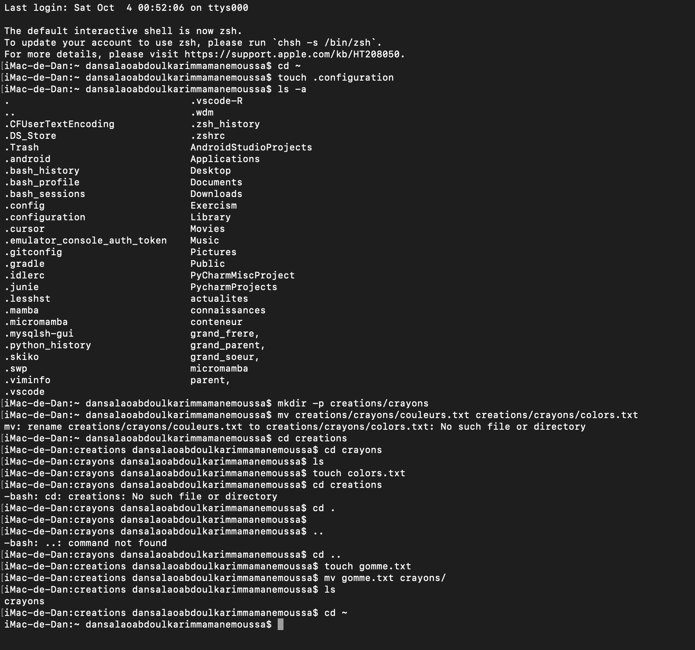

# Correction - Exercice 4 : Fichiers Cachés et Renommage (ls -a, mv)

| Tâche | Commandes Exécutées | Résultat / Vérification | Remarques |
| :--- | :--- | :--- | :--- |
| Créer fichier caché | `touch .configuration` | `ls -a` -> .configuration (doit apparaître dans la liste) | **Clé :** Un fichier caché commence par un point (`.`). |
| Vérifier sa présence | `ls -a` | Liste tous les fichiers, y compris les fichiers cachés. | L'option **`-a`** (all) révèle les fichiers cachés. |
| Créer creations/crayons | `mkdir -p creations/crayons` | - | Création d'une arborescence. |
| Créer couleurs.txt | `cd creations/crayons` `touch couleurs.txt` | `ls` -> couleurs.txt | Navigation et création. |
| Renommer couleurs.txt | `mv couleurs.txt colors.txt` | `ls` -> colors.txt | **Clé :** `mv` est utilisé pour **renommer** un fichier (ou un dossier) en le déplaçant vers un *nouveau nom* dans le même répertoire. |
| Créer et déplacer gomme.txt | `cd ..` `touch gomme.txt` `mv gomme.txt crayons/` | `ls` -> crayons `ls crayons` -> colors.txt  gomme.txt | Déplacement d'un fichier dans un sous-dossier. |
| Retour | `cd ~` | `pwd` -> ~ | Retour au répertoire personnel. |

**Difficulté Rencontrée :** Se souvenir que pour voir un fichier caché, `ls` seul ne suffit pas ; il faut utiliser `ls -a`.

