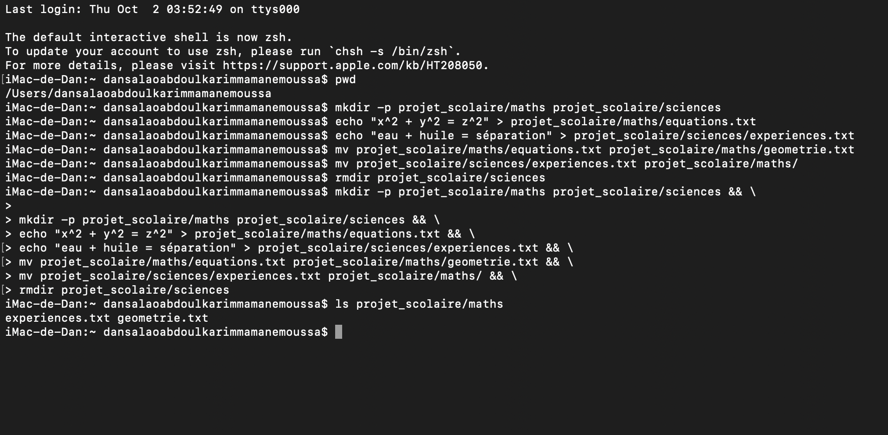

# mkdir -p projet_scolaire/maths projet_scolaire/sciences && echo "x^2 + y^2 = z^2" > projet_scolaire/maths/equations.txt && echo "eau + huile = séparation" > projet_scolaire/sciences/experiences.txt && mv projet_scolaire/maths/equations.txt projet_scolaire/maths/geometrie.txt && mv projet_scolaire/sciences/experiences.txt projet_scolaire/maths/ && rmdir projet_scolaire/sciences
1. mkdir -p projet_scolaire/maths projet_scolaire/sciences
mkdir = créer un dossier

-p = crée les dossiers parents si besoin (ici projet_scolaire)

On crée en une seule fois les deux sous-dossiers maths et sciences.

2. &&
C’est un séparateur logique :

La commande suivante s’exécute seulement si la précédente a réussi.

Ça évite de continuer si une étape échoue.

3. echo "x^2 + y^2 = z^2" > projet_scolaire/maths/equations.txt
echo affiche du texte.

> redirige ce texte vers un fichier (ici, il crée ou remplace le fichier).

Résultat : le fichier equations.txt est créé dans maths avec le contenu demandé.

4. echo "eau + huile = séparation" > projet_scolaire/sciences/experiences.txt
Même logique que l’étape précédente.

On crée experiences.txt dans sciences avec le contenu demandé.

5. mv projet_scolaire/maths/equations.txt projet_scolaire/maths/geometrie.txt
mv = move (déplacer ou renommer).

Ici, on renomme simplement equations.txt en geometrie.txt dans le même dossier.

6. mv projet_scolaire/sciences/experiences.txt projet_scolaire/maths/
On déplace experiences.txt depuis sciences vers maths.

Après cette étape, sciences est vide.

7. rmdir projet_scolaire/sciences
rmdir supprime un dossier s’il est vide.

Comme on a déplacé experiences.txt, sciences est maintenant vide → il peut être supprimé.

