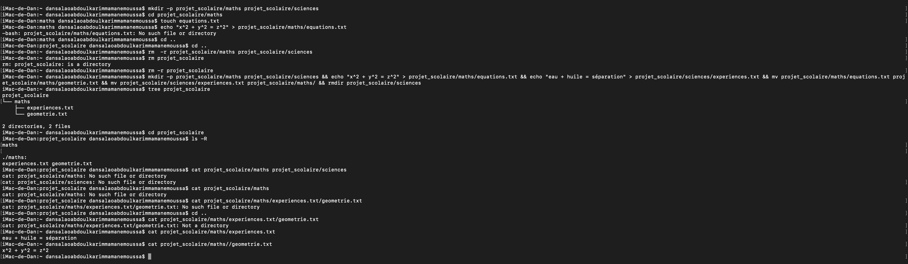

# Correction - Exercice 6 : Gestion de Fichiers Personnels (Récapitulatif)

| Tâche | Commandes Exécutées | Résultat / Vérification | Remarques |
| :--- | :--- | :--- | :--- |
| Créer et entrer dans personnel | `mkdir personnel` `cd personnel` | `pwd` -> ~/personnel | Préparation de l'environnement. |
| Créer les 3 fichiers | `touch banque.txt sante.txt .mdp` | - | Création standard + un fichier caché. |
| Ajouter contenu | `echo "Relevé bancaire janvier" > banque.txt` `echo "Vaccination complète" > sante.txt` | `cat banque.txt` -> Relevé bancaire janvier | Remplissage des fichiers. |
| Vérifier .mdp | `ls -a` | .  ..  .mdp  banque.txt  sante.txt | Vérification essentielle de la présence du fichier caché. |
| Renommer sante.txt | `mv sante.txt medical.txt` | `ls` -> .mdp  banque.txt  medical.txt  documents | `mv` pour le renommage. |
| Créer documents et déplacer | `mkdir documents` `mv banque.txt medical.txt documents/` | `ls` -> .mdp  documents | Déplacement de plusieurs fichiers à la fois. |
| Supprimer .mdp | `rm .mdp` | `ls -a` -> .  ..  documents | **Clé :** `rm` supprime le fichier caché comme n'importe quel autre fichier. |
| Retour | `cd ..` | `pwd` -> ~ | Fin de l'exercice. |

**Difficulté Rencontrée :** L'organisation des commandes de déplacement de plusieurs fichiers en une seule fois (`mv fichier1 fichier2 dossier/`) est très efficace mais nécessite de bien vérifier les chemins.

